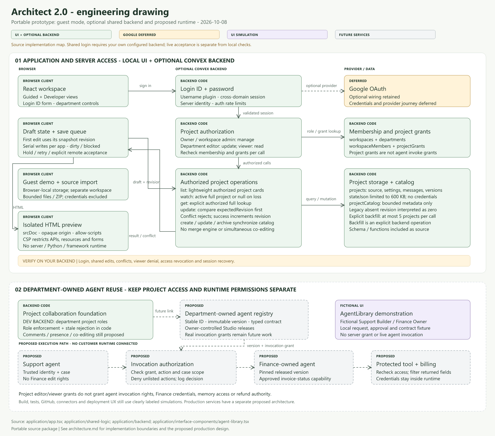
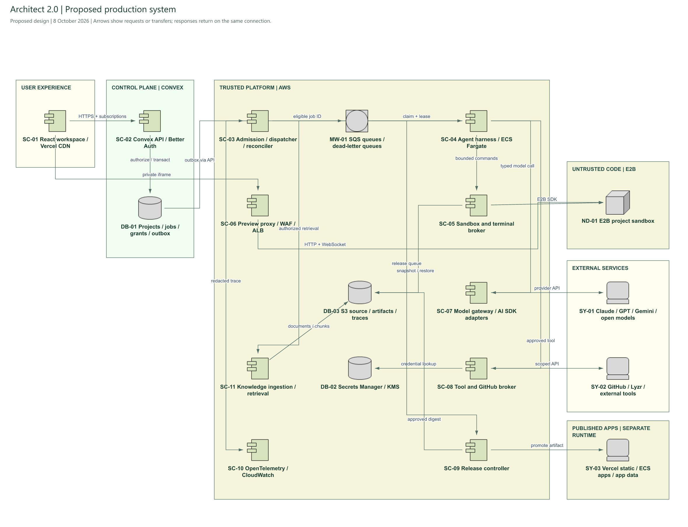

# Architect 2.0 architecture

**Prototype implementation and proposed production design · 8 October 2026**

## Prototype in this repository

The runnable application is a React/Vite workspace. Guest projects persist in browser local storage. Source files can be imported, edited, saved and exported as JSON. HTML previews run inside an isolated iframe; they do not run a Node or Python server.

When you configure your own Convex backend, Better Auth supplies login ID/password sessions. Backend functions check project ownership, workspace roles and department grants on every operation. Saves compare the expected revision before replacing state; a stale save is rejected and the client retains its draft. Project catalog records keep lists lightweight, while a separate subscription watches the active project.

**ELI10:** The browser is the workbench. An optional shared backend keeps the project and checks who may change it. The bigger system below is the design for adding real AI execution and releases.

| Responsibility | Code |
|---|---|
| Workspace and editor | [app.tsx](application/app.tsx), [workspace.tsx](application/interface-components/workspace.tsx) |
| Backend selection and identity | [backend-provider.tsx](application/shared-logic/backend-provider.tsx), [auth.ts](application/backend/auth.ts) |
| Server-enforced access | [access.ts](application/backend/access.ts), [teams.ts](application/backend/teams.ts) |
| Project revisions and catalog | [projects.ts](application/backend/projects.ts), [catalog.ts](application/backend/catalog.ts) |
| Save queue and draft recovery | [project-save-queue.ts](application/shared-logic/project-save-queue.ts), [project-sync.ts](application/shared-logic/project-sync.ts) |
| Import and payload limits | [import-project.ts](application/shared-logic/import-project.ts), [project-budget.ts](application/shared-logic/project-budget.ts) |

Generation, agent execution, connector calls, GitHub operations and generated-app releases are simulations. Department-owned agent invocation, production sandboxes and release infrastructure remain proposed. Shared project editing is revision-checked saving, not simultaneous text co-editing. The portable package contains no configured backend deployment or credentials.

## Proposed production design

Architect 2.0 needs to serve two people looking at the same project. A business user wants to explain an outcome, review a plan and try the result. A developer wants to inspect the diff, run a command, choose a model and control the release. They should share one source revision, permission model and execution history.

I would keep Convex as the control plane, run the coding harness on AWS ECS Fargate, and execute project code in E2B sandboxes. Model calls, external tool calls and private preview traffic cross separate gateways. A release promotes an approved artifact into a separate production environment. It never turns a development sandbox into the production app.

In everyday terms: Convex keeps the project records; the harness coordinates the work; the sandbox is the workshop; the gateways check what can enter or leave; the release system ships the tested result.

## Read the diagram

Start with the [system overview PNG](documentation/system-architecture.png). The PNGs are included directly so the architecture can be shared without a diagram tool.

Two focused views explain the dense parts:

- [Agent execution and private preview](documentation/agent-execution.png).
- [GitHub, deployment and operations](documentation/release-operations.png).

SC denotes a service component, DB a data store, MW middleware, ND a compute environment, SY an external or composite system, and RO a user role. Identifiers stay consistent across views. Solid groups describe ownership or execution boundaries; grouping multiple services in one box does not imply they share credentials. Arrows show requests, work notifications or artifact transfers. Responses return over the same connection unless a subscription or callback is described below.

This is a solution architecture, not a packet-level network map. Authentication callbacks, telemetry from every service, DNS and every secret lookup are described in the service catalog rather than repeated as crossing lines. The focused views expand the primary system view.

## What is evidence, and what is a design choice?

The public product documentation describes Architect's Plan → Agents → App journey, agent editing/testing, React/Next.js frontend generation, iteration and publication to a public URL. It also describes attached knowledge, structured-data analysis, themes, a prompt library and imported Lyzr Studio agents. These are documented product capabilities, not independently benchmarked claims. [Lyzr build guide](https://docs.lyzr.ai/enterprise/architect/build/build-guide), [Lyzr platform description](https://docs.lyzr.ai/enterprise/architect/introduction/platform/how-it-works).

Those pages do not establish which sandbox vendor, queue, proxy implementation or cloud topology architect.new uses internally. E2B, ECS, SQS and the gateway boundaries in this document are **our proposed choices**, not claims about Lyzr's private implementation.

| Boundary | Evidence available for this copy |
|---|---|
| Existing implementation | React/Vite UI; Guided and Developer modes; source import/edit/export; local persistence; isolated HTML preview; Convex/Better Auth code; department access and revision checks. |
| Local verification | Run `npm run check` for folder/link hygiene, frontend/backend TypeScript, automated tests and the production build. Backend tests use synthetic, in-memory data. Run `npm run eval` for focused workflow scenarios. |
| Development configuration | No configured backend or private environment file is included. Set up your own development project using the README, then verify login and cross-session access there. |
| Still simulated | Model generation, framework execution, connector operations, GitHub synchronization and generated-app deployment. |
| Proposed in this document | All production execution services, artifact promotion, retrieval, real model/tool use, capacity targets and disaster recovery behavior. No production infrastructure was provisioned for this redesign. |

A local test pass establishes behavior in the tested environment. It does not establish live login, cross-browser collaboration or production readiness for a new backend.

## Service catalog: what runs where and why

These are logical responsibilities. Initially SC-03 and the reconciliation loop can share one trusted control service. SC-05 and SC-08 can share an API deployment with separate authorization modules. Split them into independently scaled services when traffic or risk warrants it. Preview and untrusted execution remain separate from the start.

| Diagram ID | Service and hosting | Responsibility, choice and limit |
|---|---|---|
| SC-01 | React/Vite workspace, delivered by Vercel CDN | One project UI with Guided and Developer presentations. Shows plans, diffs, terminal, bounded events, approvals and release state. CDN hosting avoids consuming worker capacity to serve the editor. |
| SC-02 | Convex API + Better Auth | Authoritative identity, project access, revision checks and job admission decisions. Authenticated queries/subscriptions update the UI. Production adds verified email, recovery delivery and stronger account controls; prototype login alone is insufficient. |
| DB-01 | Convex database | Projects, grants, agent definitions, source manifests, job ledger, outbox, leases, approvals and release metadata. Keep large source archives and verbose logs out of hot documents. |
| SC-03 | Dispatcher and reconciler on ECS Fargate | Reads committed outbox work through an authenticated Convex endpoint, checks tenant admission, enqueues IDs, retries delivery and repairs expired jobs. Does not execute project code. |
| MW-01 | Amazon SQS queues + dead-letter queues | Separate build, release and ingestion work so a long import does not block interactive changes. At-least-once delivery requires deduplication and fencing. A dead-letter queue preserves exhausted failures for investigation. |
| SC-04 | TypeScript agent harness on ECS Fargate | Runs a versioned plan/patch/test loop, bounded by time, steps and spend. Long-lived workers suit streaming and recovery better than tying the job lifetime to an HTTP request. |
| SC-05 | Sandbox/terminal broker on ECS | Owns E2B API access, sandbox leases and command execution. It converts authorized operations into SDK calls and streams terminal output. Editor shell input is executed only in the assigned sandbox. |
| ND-01 | E2B project sandbox | One isolated project/branch execution environment at a time. Runs imported/generated files, package installers, tests and the dev server. Uses pinned runtime templates and explicit ingress/egress policy. |
| SC-06 / SC-12 | Private preview proxy on ECS behind WAF/ALB; isolated browser iframe | Verifies preview grants, maps a project to its allowed sandbox port and forwards HTTP/WebSocket traffic. Keeps sandbox credentials and Architect session cookies out of generated code. |
| SC-07 / SY-01 | Model gateway on ECS using AI SDK provider adapters; external model APIs | A stable request/event contract for Claude, GPT, Gemini and approved open-model endpoints. Capability checks and a model registry prevent unsupported switches. Provider secrets stay server-side. |
| SC-08 / SY-02 | Tool/GitHub broker on ECS; external services | Enforces per-operation grants, approval requirements, destination limits and credential scope. GitHub App installation access is separate from general integrations and from project edit rights. |
| DB-02 | AWS Secrets Manager + KMS | Holds platform provider keys, GitHub App private key and customer connector credentials. Separate namespaces and IAM roles restrict which broker can retrieve which secret. Source manifests contain references, never values. |
| DB-03 | Amazon S3 | Immutable source archives, checkpoints, outputs, sanitized logs and test evidence. Object keys carry tenant/project/revision identity; authorization comes from the caller and manifest, not the key's apparent name. |
| SC-11 | Ingestion/retrieval worker on ECS; sandboxed parsers; Convex vector index initially | Turns authorized attachments into searchable, tenant-scoped chunks. Structured files become read-only analysis inputs. Separate parsing from credential-bearing services. Move high-volume vector workloads to a dedicated search service only when measurements justify it. |
| SC-09 / ND-02 | Release controller on ECS; clean E2B builder | Controller selects the approved source digest and build recipe. Builder runs untrusted install/build steps without publisher credentials. Controller validates outputs and coordinates publication. |
| MW-02 | Amazon ECR | Stores scanned OCI container images by immutable digest. A trusted publisher uploads the image bytes; it does not run the user's Dockerfile. |
| SY-03 / SY-04 | Generated static apps on separate Vercel projects | Static output is the first Vercel deployment target. Server-rendered Node workloads require a tested deployment adapter; Python services use the container path. Vercel is not treated as a universal runtime. |
| ND-03 / MW-03 | Generated container apps on ECS Fargate, separate AWS runtime account; cell-based app router, ALB, ACM and DNS | Per-app tasks, identities, resource budgets and routing. Route by app/release identity to a private healthy task. Separate cells avoid one unbounded load-balancer rule set or one giant blast radius. |
| DB-04 | Per-app managed database and object storage | Provision a separate Convex project for compatible templates, or a customer-owned database through an adapter. Generated apps never receive access to Architect's control database. Backup, schema migration and teardown are app-specific. |
| SC-14 | Published-app model/tool gateway | Same contract family as SC-07/08, but a distinct runtime audience, permissions and budgets. An end user's support conversation must never acquire the coding agent's file-edit or deployment rights. |
| SC-10 | OpenTelemetry collection + CloudWatch logs, metrics and alarms | Correlates request, tenant, project, job, sandbox and release IDs. Records latency, spend, retries and policy outcomes. Sensitive content is redacted before storage; full prompts are not logged by default. |
| SC-13 / SY-05 | GitHub Actions + infrastructure as code; Architect's own Vercel/Convex/ECS deployments | Tests and releases the trusted platform separately from generated applications. AWS uses short-lived OIDC credentials; other provider deployment credentials are narrowly scoped and held in CI secrets. |

AWS documents task-level isolation for Fargate; containers within a task are not independent security boundaries. Use separate tasks and roles for separate app identities. [AWS task IAM roles](https://docs.aws.amazon.com/AmazonECS/latest/developerguide/task-iam-roles.html).

## 1. Sandboxes: a disposable workshop with durable source

**Decision:** E2B for project execution, behind our own sandbox broker. A sandbox belongs to a tenant, project, branch and lease epoch, not permanently to a login. Two tabs viewing the same branch share the workspace; concurrent writers are serialized or work on separate branches.

E2B documents an isolated Linux VM lifecycle with creation, connection, pause/resume and shutdown. Its SDK exposes network controls, including restricted public access. Those capabilities support this proposal, but exact plan limits, region availability, quotas and latency must be confirmed before purchase. [E2B lifecycle](https://docs.e2b.dev/sandbox), [E2B network API](https://github.com/e2b-dev/E2B/blob/main/packages/js-sdk/src/sandbox/sandboxApi.ts).

Use pinned Node and Python templates. The framework adapter defines runtime version, dependency lockfile, install/build/test/start commands, health endpoint, port and artifact type. LangGraph, CrewAI, OpenAI Agents and Lyzr integration are candidate adapters. Each needs an import/run/evaluation fixture before being listed as supported. “Custom” means an explicit runtime contract; it is not a guarantee that arbitrary software works.

Import does not execute anything immediately. Validate archive size, expanded size, file count, paths and symlinks; reject traversal and decompression bombs. Inspect manifests and scripts, show the detected runtime, then run dependency installation inside the sandbox with registry access only. Disable unexpected hooks or require an explicit review for the broader build step.

Default-deny outbound traffic; allow only broker endpoints and the dependency hosts needed for the current phase. Disable unauthenticated public sandbox access. No provider keys, GitHub tokens, AWS deployment keys or host Docker socket enter a project sandbox. An arbitrary shell command is still untrusted even when a human typed it.

Save immutable source snapshots to S3 after accepted edits and before release. Pause idle environments after an initial five-minute policy, with a visible countdown; choose retention separately. Restore source from S3 if the sandbox disappears. Warm templates and cached public dependencies speed startup, but warm environments containing customer data are never assigned to another tenant.

**Trade-off:** E2B reduces the work of operating VM isolation and interactive execution. It introduces vendor quotas, network latency and recurring runtime cost. Self-hosted Firecracker is a later option when scale or residency pays for the operating burden. Browser-only runtimes cannot cover the Python/server requirement; ordinary shared Docker containers are not our tenant boundary.

**ELI10:** Each project gets its own workshop. Its work is saved outside that workshop, so losing the machine does not lose the project.

## 2. The harness: plan, act, verify and recover

**Decision:** one durable controller for a build job, with specialized model calls where useful. Do not begin with a swarm of independent agents editing the same files.

The harness is Architect's coding coordinator. It is distinct from the support, research or sales agents inside the app being built. A CrewAI output project does not require Architect's own controller to be written in CrewAI.

1. Authenticate the user, authorize the project operation and bind it to a source revision.
2. Inspect the source manifest and authorized knowledge; produce a structured plan with acceptance checks.
3. Show the plan in Guided mode or alongside a diff in Developer mode. Approval binds the plan digest and source revision.
4. Reserve a bounded budget and create the job plus outbox record in one Convex mutation.
5. Dispatch the job ID. A worker atomically claims a lease with a monotonically increasing fencing epoch.
6. Call the selected model with a bounded context and typed tool definitions. Validate every proposed tool and argument server-side.
7. Read files, apply a patch against the expected content hash, run checks in E2B and checkpoint accepted state.
8. Summarize test failures, attempt a bounded repair, then expose either the working preview or a recoverable error.
9. Persist final events, release unused budget and close the lease. Human approval waits release worker capacity and resume as a new job step.

A scheduled action can deliver an outbox entry, but we still reconcile failures between Convex and AWS. Convex's transactional scheduling is not a distributed transaction with SQS. The committed outbox is authoritative; a dispatcher crash after sending produces a possible duplicate, not a lost job. [Convex scheduling](https://docs.convex.dev/scheduling/scheduled-functions).

Store job ID, source digest, harness version, template version, model policy, current step, lease epoch, approval references, budget reservation, last checkpoint and terminal state. Workers have scoped service identities; public browser mutations cannot forge job completion. Every callback includes the current lease epoch and an operation ID.

| Failure | Recovery behavior |
|---|---|
| Model timeout or 429 | Backoff with jitter inside the remaining deadline. Fallback only to a pre-approved compatible model. Record uncertain usage rather than assuming a timed-out call was free. |
| Invalid tool arguments | Reject before execution; allow a bounded correction. Never convert malformed input into unrestricted shell execution. |
| Compiler/test failure | Feed a bounded, redacted diagnostic back to the model. Initial policy: at most three repair attempts and twenty tool steps, with an explicit user extension. These are tuning assumptions. |
| Worker crash / duplicate SQS delivery | Reclaim only after lease expiry. Advance the fencing epoch; reject writes from the old worker. Resume from the last durable checkpoint. |
| Sandbox dies | Recreate from a pinned template and S3 source. Re-run verification; do not invent a successful result from an old log. |
| External action times out | Reconcile by provider operation ID or read-back before retrying. If the effect is uncertain, pause for review. |
| User edits during generation | Compare base revision before applying. Preserve both drafts and ask for merge/conflict resolution. |
| Cancellation | Mark cancellation durably, revoke new tool grants, stop sandbox processes and reconcile any external action already in flight. |

SQS Standard queues can deliver messages more than once. The idempotency key must identify the logical action across attempts, not include a fresh retry number. A local key alone does not stop duplicate external effects. [SQS delivery semantics](https://docs.aws.amazon.com/en_gb/AWSSimpleQueueService/latest/SQSDeveloperGuide/standard-queues-at-least-once-delivery.html).

Maintain the harness with pinned releases, golden task fixtures, adversarial tool tests, canary runs and rollbackable configuration. Compare patch correctness, test success, source preservation, tool-policy compliance, latency and cost across releases. Display concise plans, actions and evidence to users, not private model reasoning.

**ELI10:** The coordinator saves its place after each useful step. If something breaks, it resumes safely instead of starting over or repeating a real-world action blindly.

## 3. Model switching without changing the application contract

**Decision:** an internal ModelRequest/ModelEvent contract with AI SDK provider adapters. The SDK supplies provider integration; our gateway supplies tenant policy, capability checks, budgets and audit. LiteLLM is a credible alternative when centralized gateway operations outweigh adding a separate Python service. We do not deploy both initially.

AI SDK documents a common provider interface and provider-specific capability differences. That helps keep our API stable; it does not make every model equally capable. [AI SDK providers](https://ai-sdk.dev/docs/foundations/providers-and-models), [provider aliases](https://ai-sdk.dev/docs/reference/ai-sdk-core/custom-provider).

A request carries model alias, task class, messages, tool schemas, output schema, allowed modalities, budget and deadline. The gateway emits text deltas, structured tool proposals, usage, finish reason and normalized errors. Provider-specific IDs remain attached for debugging and reconciliation.

The model registry records tools, structured output, context size, image support, regional availability and tested adapter version. A user selects an approved model alias, not an arbitrary endpoint URL. Customer-hosted endpoints need separate onboarding and network verification. An open model can run behind an approved OpenAI-compatible service; dedicated GPU hosting is a later capacity choice, not free compute supplied by the browser.

Switch at a checkpoint between model calls. Rebuild a provider-neutral transcript from explicit messages, tool results and a verified task summary. Do not forward provider-specific hidden reasoning or assume prompt caches transfer. Revalidate context length and tool schema support. If the chosen model lacks a required capability, disable that choice or request a deliberate workflow change. Never silently discard tools or change residency to make a fallback work.

Framework compatibility and model compatibility are independent. An adapter might run Python correctly while its selected model still fails the task. Changing an embedding model requires a versioned index and re-embedding; it is not the same as switching the coding model.

**ELI10:** Models can plug into the same socket, but each must pass the job's capability checks before being used.

## 4. Frontend, backend, terminal and live preview

The browser talks to Convex for identity, project commands and bounded reactive state. A build request returns a job ID quickly; it does not hold one HTTP request open for the entire build.

The worker writes durable step transitions to Convex and large logs to S3. A bounded event tail powers reconnects. Token/terminal output uses a dedicated authenticated streaming endpoint with sequence IDs and backpressure. Do not write a whole growing transcript to one database document for every token. The UI reconnects from its last sequence number and can fetch archived log segments through scoped URLs.

The browser does not hold an E2B API key or choose a raw sandbox destination. For terminal use, SC-02 grants a short-lived Editor capability bound to project, sandbox, port/operation and expiry. SC-05 checks it before opening a PTY stream. Revoking project access closes streams and prevents renewal.

For preview:

1. The backend verifies Viewer-or-higher access to the project and mints a short-lived, one-use ticket bound to the sandbox version.
2. The browser exchanges it with SC-06 on a dedicated preview domain, using a bootstrap message from an explicitly allowed parent origin.
3. The proxy establishes a host-only preview session and forwards only the registered application port. E2B upstream access credentials remain on the proxy.
4. The iframe receives the app's HTTP responses and HMR/WebSocket traffic. It never receives Architect's auth cookie or the sandbox management API.
5. Permission revocation invalidates the preview session; a short TTL bounds missed revocation signals. New sessions fail closed when authorization is unavailable.

Use a distinct registrable preview domain with a per-project hostname, not a cookie-sharing path under the editor. Sandbox iframe permissions should permit needed scripts while denying top-level navigation and privileged browser features by default. Restrict framing to the editor with CSP, validate postMessage source/origin, and filter response headers. Never accept a browser-supplied arbitrary upstream URL: that turns a preview proxy into an SSRF service.

Cross-site cookie restrictions vary. Prototype the bootstrap and WebSocket handshake on Chrome, Safari and Firefox before committing to the cookie design. Where embedded sessions are blocked, use an authenticated top-level preview handoff; do not fall back to a publicly accessible sandbox.

## 5. Where the proxies sit

| Boundary | Position | What it checks |
|---|---|---|
| Preview ingress, SC-06 | Browser iframe → WAF/ALB → ECS proxy → E2B app port | User/project access, preview ticket, allowed port, session expiry, origin, request limits and upstream sandbox identity. |
| Model gateway, SC-07 | Trusted harness → gateway → approved provider | Model capability, tenant policy, residency, token/spend budget, credentials and normalized streaming. |
| Tool broker, SC-08 | Harness → policy/approval gate → external API | Tool schema, exact resource/action grant, current user rights, destination, approval digest and duplicate-effect reconciliation. |
| Sandbox network policy | Untrusted execution → restricted egress → allowed broker/registry hosts | Enforces the route even when generated code ignores the SDK. No direct bypass to provider APIs or internal metadata. |
| Published runtime gateway, SC-14 | Generated production app → app-scoped gateway → models/tools | App runtime identity and end-user authorization. Distinct from build/terminal/deployment permissions. |

An API gateway is not a substitute for code-execution isolation. A shell command inside a sandbox can still destroy that sandbox's files. Checkpoints and leases address that failure; outbound policy limits which external resources it can affect.

## 6. GitHub: scoped access and explicit source ownership

Use a GitHub App installed on selected repositories. Save the installation ID and repository binding in the control plane; keep the private signing key in DB-02. Generate short-lived, repository-scoped installation tokens in SC-08. GitHub documents installation tokens with a one-hour expiry and permission restrictions. [GitHub installation authentication](https://docs.github.com/en/apps/creating-github-apps/authenticating-with-a-github-app/authenticating-as-a-github-app-installation).

**Import:** verify the current user may use the installation; fetch an exact commit through the broker; store a source snapshot in S3; inspect the project; open an E2B environment. Treat source, README instructions and build scripts as untrusted data.

**Push:** show changed files, base commit and target branch. Approval binds the diff and branch. The broker creates a commit/branch or PR using the GitHub API; it does not expose its token to a shell. If the remote head moved, fetch and offer a three-way merge. Do not force-push over another developer's changes.

**Webhooks:** check the raw-body HMAC signature before processing, deduplicate the delivery ID, then authorize installation/repository mapping. Uninstall and permission changes revoke future use. GitHub's signature validation proves delivery origin; it does not replace tenant authorization. [GitHub webhook validation](https://docs.github.com/en/webhooks/using-webhooks/validating-webhook-deliveries).

GitHub is optional. A source revision saved in S3 can be released without creating a repository. Connecting GitHub must not become a hidden requirement for a non-technical user.

## 7. Deploying the user's app

Separate building, approving and publishing. A release manifest binds source digest, build recipe, dependency lock, template/model versions, test report, artifact digest, environment, domain and secret references.

The clean ND-02 sandbox restores the pinned source and executes the build. For containers, prototype a supported rootless OCI build recipe in E2B; privileged Docker is not assumed. If that recipe is unsupported, use a dedicated isolated VM build pool behind the same builder interface. This builder choice is a release gate to test, not a demonstrated feature.

The sandbox emits static output or an OCI archive into a scoped artifact location. A trusted scanner verifies size, file paths, digest, dependency/image findings and the expected output contract. The publisher never executes project hooks. It uploads container bytes to ECR or prebuilt static output to Vercel. Vercel documents a prebuilt deployment path that separates build from publication. [Vercel deployment CLI](https://vercel.com/docs/cli/deploy).

Start the candidate release without sending public traffic. Run health and synthetic workflow checks. Show the user the environment, URL, checks and estimated ongoing resource allocation. Approval then promotes the exact tested revision. Generated production apps use separate task identities and app databases, not the dev sandbox or Architect control database.

For a support app, its runtime executes the selected agent framework and calls SC-14 with app-specific grants. Customer messages and knowledge belong to that app's data boundary. A refund or email tool needs its own runtime approval policy; approving the app's deployment is not approval for every future action.

Static and container routes have separate adapters. A static frontend with an agent backend is a coordinated release of both artifacts. Database migrations need an explicit compatible migration plan and backup. Rollback re-routes to the prior artifact; it cannot undo arbitrary external actions or reverse an incompatible data migration automatically.

## 8. Deploying Architect itself

Deploy the editor's static build to Vercel. Use separate Convex development, staging and production deployments with matching auth origins. Deploy trusted services as versioned ECS Fargate services behind an ALB, across at least two availability zones. Keep generated-app runtime cells in a separate AWS account.

Manage SQS, S3, ECR, IAM, KMS, networking, alarms, DNS and TLS certificates through infrastructure as code. Separate environment secrets and provider quotas. E2B region placement and data processing terms must be verified; do not infer residency from the location of Convex alone.

GitHub Actions tests the trusted codebase, runs backend permission tests and browser journeys, builds immutable platform images and publishes only after review. Use OIDC for AWS rather than long-lived AWS keys in CI. Deploy compatible backend changes first, then workers/gateways and the frontend. Drain leased jobs before replacing workers; keep old protocol versions available during the rollout.

A platform rollback reverts worker/gateway image digests and the UI build. Database changes use an expand/migrate/contract sequence, rehearsed on non-production data. Back up Convex and version S3 manifests. Initial recovery objectives—RPO of 15 minutes for control metadata and RTO of four hours—are proposed targets requiring a restore drill and a suitable backup/export schedule. They are not guarantees from the current prototype.

## 9. Thousands of users: admission before autoscaling

Count open workspaces, active builders, live previews and published-app traffic separately. They consume different resources.

An illustrative planning scenario:

| Assumption | Calculation | Implication |
|---|---|---|
| 5,000 connected users; 8% building | 5,000 × 0.08 = 400 active build jobs | Reserve up to 400 sandbox slots only if provider quota and budget allow. |
| A build occupies a slot for 180 seconds on average | 400 / 180 = 2.22 completed jobs/second | About 133 jobs/minute at steady state; this is not a benchmark. |
| 40 admitted builds/minute instead | 40 × 3 minutes = 120 active sandboxes | Arrival rate and duration determine active concurrency. |
| 1,000 private previews at 100 kbit/s average | 1,000 × 100 kbit/s = 100 Mbit/s | Roughly 45 GB/hour before overhead; preview traffic can dominate bandwidth cost. |
| 400 running sandboxes for one hour | 400 sandbox-hours | Multiply by the selected size/region price; add models, gateways, storage and egress. |

Admission checks per-user and per-tenant concurrency, remaining spend, provider request/token quotas, sandbox capacity and release capacity. Reserve budget atomically, reconcile actual usage and release unused reservations. During a provider outage, queue or reject new work visibly instead of starting chargeable sandboxes that cannot progress.

Use fair tenant scheduling before SQS, cap heavy tenants and apply separate queues for interactive builds, releases and ingestion. SQS is transport, not our fairness policy. Scale workers on oldest waiting work and backlog per available worker, with provider capacity as an upper bound. Protect active tasks from scale-in, heartbeat leases and drain safely. AWS recommends backlog-per-task scaling and protection for in-flight work. [ECS queue scaling](https://docs.aws.amazon.com/AmazonECS/latest/developerguide/service-autoscaling-queue.html).

Keep a small warm worker pool so division-by-zero does not stall scale-from-zero behavior. Sandbox warm pools contain only clean templates. Reuse dependency caches by verified lockfile hash, with tenant-private caches for private packages.

Partition frequently updated job events; avoid a single global counter or one document holding every run. Batch UI progress updates and use S3 for verbose streams. Load-test hot indexes, tenant isolation, subscriptions and transaction contention against the chosen Convex deployment class. Published apps scale separately by request concurrency, CPU/memory and their own queue depth.

Expand to regional cells only after measuring. Each cell has bounded gateways, queues, workers and runtime routing. Tenant placement records define the home region; do not silently move data across regions on failure.

**Cost model:** model tokens + active sandbox time + trusted-worker compute + published-app runtime + storage + network transfer. Quote prices only after selecting provider plans and regions. A provider's advertised benchmark is not evidence that this architecture supports our workload.

## 10. Supporting capabilities the brief also needs

**Knowledge and attachments:** upload through tenant-scoped signed storage operations; scan and parse in isolation; chunk with source attribution; embed through the model gateway; index with tenant/project/ACL filters. Retrieval rechecks permissions. Changing document access triggers index invalidation and eventual deletion with a documented retention window. CSV analysis runs in a sandbox, not in the control database.

**Existing Studio agents:** register an external-agent adapter with endpoint identity, input/output schema, auth reference, version and allowed callers. Invoking a Finance-owned agent from Support requires a separate invocation grant; Editor access to a project must not imply permission to use Finance tools.

**Two audiences:** Guided mode surfaces plan approval, progress and recovery choices. Developer mode adds source diffs, runtime manifests, terminal, tests, model selection and trace IDs. Both see the same evidence and security outcomes. Hiding a control in Guided mode does not remove its backend enforcement.

**Source ownership:** retain exportable source, dependency locks, runtime configuration and an app-scoped deployment manifest. A customer should be able to leave with a reproducible project, even if managed integrations need replacement credentials.

## 11. Decisions, alternatives and proof still required

| Decision | Chosen approach | Alternative / trigger to revisit |
|---|---|---|
| Durable project state | Convex + S3 manifests | Postgres/control API if relational reporting, portability or transactional workload limits dominate. Avoid an early migration solely for fashion. |
| Untrusted development | E2B via a broker | Self-hosted microVM fleet if residency, unit cost or quota needs justify a dedicated platform team. |
| Controller | Versioned TypeScript harness on ECS | A durable workflow engine becomes useful when job graphs and compensation grow beyond the explicit ledger. Do not maintain two orchestration sources of truth. |
| Model portability | AI SDK behind one policy gateway | LiteLLM when its gateway operations reduce more work than its additional deployment creates. |
| Multi-user editing | Revision checks and branch ownership first | Add CRDT collaboration only when simultaneous character-level editing is a confirmed need. |
| Release runtime | Vercel static + Fargate services | Kubernetes when measured scheduling, service mesh or GPU needs justify its operating cost. |
| Framework breadth | Tested adapters with declared limits | Expand through contract fixtures; never turn “any framework” into an untested compatibility promise. |

Before calling this production-ready, demonstrate:

1. A real prompt generates and tests a small support app; source survives a worker and sandbox restart.
2. Duplicate delivery and a stale worker cannot overwrite a newer revision or repeat a consequential external action.
3. Viewer, revoked and unrelated accounts cannot access terminal, preview, files or tools outside their grants.
4. A hostile imported project cannot retrieve host credentials, reach control-plane internals or bypass outbound rules.
5. A model switch either passes the required capability checks and task evals or is rejected with a clear explanation.
6. GitHub import/push and conflict recovery work against a disposable repository with token revocation.
7. An approved artifact reaches a real URL, fails safely on bad health, and rolls back to a previous healthy release.
8. The expected workload passes load, spend-limit and restore drills within explicitly measured targets.

The smallest useful production slice is a prompt-generated support app in one framework, with a real model call, isolated preview, saved source and a real staged release. The diagram shows the expansion path; it does not require every logical component to become a microservice on day one.

## Sharing these artifacts

This repository includes this decision document and four PNGs: the prototype map, proposed system overview, agent execution, and release/operations. The original authoring copy retains the HTML, JSON and SVG diagram sources; this compact handoff includes the rendered PNGs only.

The production proposal and its source citations were carried over from the 8 October 2026 architecture document. Provider APIs, limits, prices and regions need a fresh check before implementation. All uncited policies and capacity figures are design assumptions.
