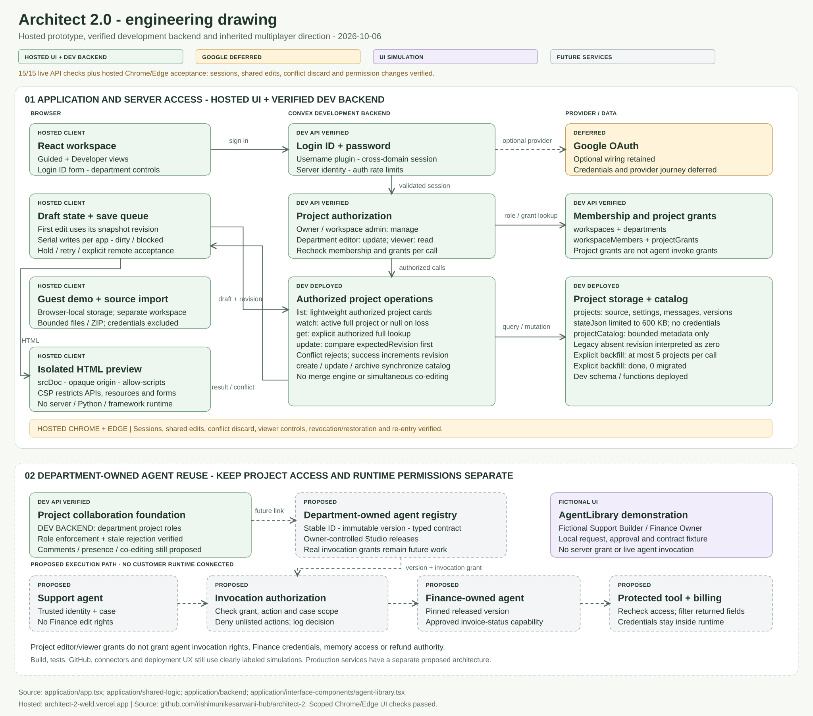
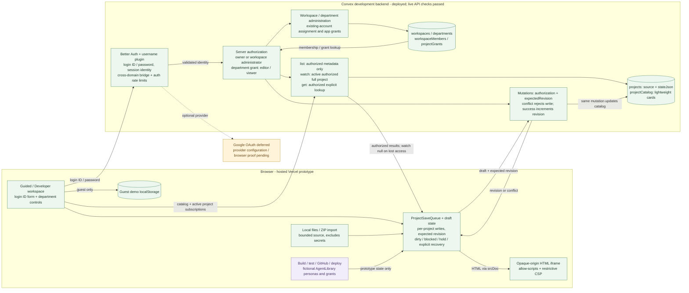
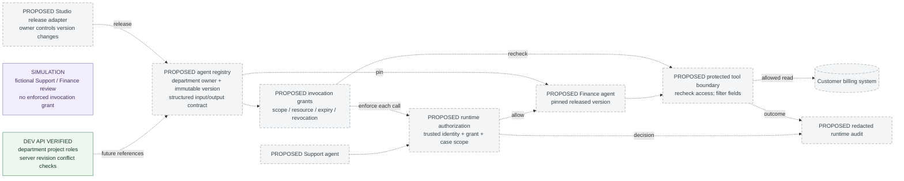

# Architect 2.0 engineering drawing

This drawing maps the **working prototype**: a React workspace, isolated HTML preview, Better Auth login ID/password accounts, and Convex project storage with department permissions and revision checks. Authorized people edit the same saved project. Guest projects stay in local browser storage. Builds, external tools, GitHub operations, shared-agent grants and generated-app deployment are labeled simulations.

The [published app](https://architect-2-weld.vercel.app) and [source repository](https://github.com/rishimunikesarwani-hub/architect-2) are public; the app uses the dedicated **development** backend. Production execution, the shared agent registry and runtime invocation permissions are proposed separately in the [production architecture](arch-production-architecture.md). Google remains deferred.

Backend evidence snapshot: **6 October 2026**. The approved auth, department and catalog update reached `dev:perceptive-ermine-27` on October 5 at 22:44 IST. All **15 live API checks** passed, followed by the scoped Chrome/Edge session, shared-edit, conflict and permission checks in the [hosted acceptance record](../verification-records/2026-10-06-hosted-department-acceptance.md). The document and folder-path revision on October 7 does not imply a new backend deployment or production runtime verification.

[Open the full-size vector drawing](arch-engineering-drawing.svg) | [PNG](arch-engineering-drawing.png).

## How to read the drawing

| Status | Meaning |
|---|---|
| Hosted prototype and development evidence | The Vercel frontend and source repository are public; the approved development backend has 15 passing live API checks. Hosted Chrome/Edge acceptance verifies the scoped account, shared-edit and permission journeys below; production readiness is not established. |
| Deferred Google | Optional provider wiring remains; credentials and a Google round trip are not part of the completed verification. |
| Simulated | A UI demonstration updates prototype state. No live model, GitHub write, external tool, email invitation or app deployment runs. |
| Proposed | Agent registry, runtime invocation grants, protected execution, comments and simultaneous co-editing remain future work. |

The department deployment supersedes the earlier owner-only snapshot. We have the actual backfill result: `catalog.backfillLegacy` returned `done: true, migrated: 0`. Readiness returned password true and Google false. The old localhost check showed that the forms were ready; the October 6 hosted check went further, using an owner in Chrome and an independent department member in Edge. [the hosted prototype](https://architect-2-weld.vercel.app), [Live backend smoke report](../verification-records/2026-10-05-department-backend-smoke.json), [hosted UI acceptance](../verification-records/2026-10-06-hosted-department-acceptance.md).

## Current application architecture

If you explore as a guest, your demo projects stay separate from authenticated projects. Signing in does not automatically upload them. The login ID/password forms use Better Auth’s username plugin with the existing Convex session integration. The server session supplies the account identity; a caller cannot choose its own owner, department or role. Google remains optional and deferred. Email verification and password-reset delivery are not configured. Readiness tells us that configuration is present; successful sign-in needs its own evidence. [Client bridge and project handoff](../application/app.tsx), [login form](../application/interface-components/department-auth.tsx), [auth configuration](../application/backend/auth.ts), [auth client](../application/shared-logic/auth-client.ts).

### Project permissions and data boundaries

The permission check starts in `projectAccessFor`. The project owner or its workspace administrator gets owner access. Another workspace member needs a grant for their department in that same workspace: Viewer can read, Editor can update. Management stays with the owner/admin. Supplying an email address, claiming a role or getting an LLM to say “approved” does not grant access. Reactive queries and every mutation recheck membership and grants, so a revoked permission affects subsequent access. [Authorization helper](../application/backend/access.ts), [department mutations](../application/backend/teams.ts), [department UI](../application/interface-components/department-access.tsx).

The project list needs enough information to show a card, so the catalog carries the title, bounded description, framework, stage, revision and presentation/count fields. It leaves out the full `stateJson`. `projects.list` returns authorized card metadata. `projects.watch` returns the active authorized full project, or null if it becomes unavailable or unauthorized; that lets the UI handle revoked access without an exception tearing through the render tree. `get` remains the explicit authorized lookup. Full documents hold source files, messages, settings, sample agents and checkpoints, within a 600 KB state limit. This is the prototype’s working access and persistence layer. Agent execution still needs the proposed runtime. [Project functions](../application/backend/projects.ts), [catalog helpers](../application/backend/catalog.ts), [schema](../application/backend/schema.ts).

Create, update, archive and workspace attachment keep `projectCatalog` and the full project synchronized in the same mutation. A legacy document can omit its revision; the code treats that as zero. For migration, the internal `catalog.backfillLegacy` operation handles at most five legacy source documents per call. Deployment does not run it automatically. During the transition, the owner-only list fallback also covers five legacy documents. The approved development deployment and explicit backfill completed with `done: true, migrated: 0`, so that run did not migrate any legacy documents. No production schema deployment is implied.

### Saves, conflict handling and draft recovery

Before a save, the backend checks permission and compares `expectedRevision` with the stored revision. If they differ, it returns `REVISION_CONFLICT`. If they match, the write succeeds and the revision increases. That is optimistic concurrency: an older full-state save cannot quietly replace a newer document. It does not merge two drafts or provide character-by-character collaboration. [Update mutation](../application/backend/projects.ts).

`ProjectSaveQueue` puts each project’s writes in order while letting other projects continue. When the same client already has a dirty draft, later edits follow the revisions acknowledged by successful saves. A first clean draft uses the revision it actually started from. This matters when a newer subscription arrives before the UI has applied its contents: that arrival must not authorize an overwrite of a version the editor has never seen. Subscriptions cannot advance a dirty or blocked baseline. On failure, the queue keeps the draft dirty, drops scheduled older snapshots and blocks that project; retry uses the previous baseline. `hold` restores a draft without writing. `acceptRemote` installs a baseline the caller explicitly accepted after preserving or discarding its local copy. `reset` invalidates callbacks from the previous account. Neither method cancels a request already sent to the server. [Queue implementation](../application/shared-logic/project-save-queue.ts), [11 focused queue tests](../automated-tests/project-save-queue.test.ts).

The app gives the user explicit retry and a way to preserve work as a private copy. The hosted Chrome/Edge check showed an editor’s save reaching the owner without reload. When the owner had a conflicting typed draft, that text stayed intact and Save became disabled; explicit discard then restored the remote source. Viewer controls changed live, revocation closed and removed the app, and restored access returned after sign-out and normal sign-in. These are browser observations alongside the queue tests and API checks. The same QA app’s 3,270-byte Download my draft HTML file later matched its exact file hash. That still leaves untested retry/private-copy branches. Draft recovery is in memory, so closing or reloading the tab loses an unsaved recovery copy. [Supplemental verification](../verification-records/2026-10-06-supplemental-ui-verification.md), [Hosted acceptance](../verification-records/2026-10-06-hosted-department-acceptance.md), [app integration](../application/app.tsx), [source editor](../application/interface-components/workspace.tsx).

**Technical:** A revision is the shared project document’s version number. An editor saves against the version they edited. If someone else saved first, the server rejects the stale write and asks the user to review or recover the draft.

**ELI10:** If we both open a page and you save first, my older copy cannot silently erase your work. I have to look at your update before deciding what to keep.

### Preview and verification boundary

The preview iframe has `sandbox="allow-scripts"` and does not have `allow-same-origin`. The app parses the supplied HTML before inserting a restrictive CSP. That isolates host cookies/storage and restricts resource loading, network APIs and forms. There is an important limit: a script can still navigate its own frame. This is an HTML preview, not a server sandbox or a complete network-isolation boundary. It does not run React, Python or server processes. [Preview implementation](../application/interface-components/workspace.tsx).

The backend access/auth unit tests check behavior in local memory, and the focused queue suite previously passed 11 tests. We also have separate **15/15 live checks** against `dev:perceptive-ermine-27`. Four synthetic accounts completed normal signup and login-ID sign-in. Independent department clients read the same app ID/source; an editor’s save propagated; viewer writes/grants and outsider/anonymous access were denied. Stale revisions could not overwrite source, revocation removed editor access, and an incorrect password was rejected. Normal logout invalidated the owner session even with its previous JWT. The synthetic sessions were closed; the labeled QA accounts, workspace and app were retained. [Live smoke results](../verification-records/2026-10-05-department-backend-smoke.json), [backend tests](../automated-tests/backend-teams.test.ts), [auth tests](../automated-tests/backend-auth.test.ts).

The API checks use Better Auth HTTP and independent Convex clients. The **hosted Chrome/Edge UI checks** are a separate layer of evidence. They cover owner/member session reload, an editor save reaching the owner without reload, a preserved conflicting owner draft with Save blocked, and explicit discard to the remote source. Moving the member to Finance Viewer disabled editing, access management, GitHub and deployment controls. Revocation closed and removed the app. Restoring Support Editor access worked, as did Edge logout/reload to guest followed by normal sign-in and reopening the shared app. [Hosted acceptance record](../verification-records/2026-10-06-hosted-department-acceptance.md).

The user completed browser signup; that step was not independently observed. Once the user enabled Chrome’s file-access permission, the hosted ZIP chooser imported the exact two-file fixture into a new private Custom app. Preview interaction, source editing and exact source/README persistence after reload all passed. In the separate department QA app, the 5,415-byte JSON source export and 3,270-byte conflict-draft HTML download arrived and were checked by exact file hashes. Source export is JSON; no ZIP export is claimed. These results support the named journeys. They do not establish every UI branch, and they did not deploy the proposed production execution infrastructure. Google remains deferred. [Hosted import acceptance](../verification-records/2026-10-06-hosted-import-acceptance.md), [Supplemental verification](../verification-records/2026-10-06-supplemental-ui-verification.md).

## Multiplayer direction inherited from prior work

The multiplayer direction comes from Rishi’s earlier deck brief: a shared Architect–Studio workspace where **each department owns its agents**, and other teams reuse them through permissions and a structured schema. Support and Finance are the running example. A small customer pilot was the proposed next step. The historical sources sit outside this repository: `Research_Data/multiplayer-agent-deck/deck-brief.md` (Confirmed decisions, Ownership decision, Running-example decision) and `deck-plan.md`. They record product choices, not a deployed registry or an approved production schema.

The inherited `architecture.md` and `github-submission/architecture.md` describe server drafts, comments, conflicting-save rejection, a department-owned agent registry, invocation grants, Studio/OpenController adapters and customer runtime as proposed services. The current code now implements project membership, department grants and revision rejection. The registry and execution services still need to be built. An app-editing grant does not authorize calling another department’s agent.

The Agent library is still a **fictional UI simulation**. Support Builder and Finance Owner are browser personas. Request/approval state lives in `architect-2-library-simulation-v1`, sample JSON validation returns a fixed fixture, and reuse creates a project from the selected contract and prompt. Those approvals do not write `projectGrants`, create real membership, authorize runtime access or connect a live Finance agent. A signed-in account can save the resulting prototype project through the normal project persistence flow. [Agent library component](../application/interface-components/agent-library.tsx).

**Technical:** Project membership, permission to edit an agent definition and permission to invoke a released capability are separate checks. The implemented project roles cover the first boundary; runtime authorization remains proposed.

**ELI10:** Letting Support edit a project does not give it Finance’s account keys or permission to issue refunds.

## Current versus future state

| Boundary | Current implementation and evidence | Still proposed or pending |
|---|---|---|
| Authentication | Deployed Better Auth login ID/password; live API sign-in/denial/logout checks plus hosted Chrome/Edge session reload and Edge logout/reload/re-entry passed | Browser signup was user-performed, not observed; Google deferred; email/reset delivery absent |
| Project access | Live API owner/editor/viewer/outsider enforcement; hosted viewer controls, revocation closure/removal and Support Editor restoration passed | Exhaustive account/permission combinations and production runtime authorization remain separate validation |
| Data loading | Deployed catalog/full-project watch; shared app source, reactive updates, access removal and restored shared-app entry verified in hosted sessions; zero-document backfill completed | Broader loading/network failure and recovery scenarios |
| Editing | Live API stale rejection plus hosted editor propagation, preserved conflicting draft/blocked Save and explicit discard to remote source passed; QA conflict-draft HTML download hash verified | All retry/private-copy branches not established; conflict diff/merge, comments and simultaneous editing remain proposed |
| Agent ownership | Per-project sample agents; fictional AgentLibrary department personas | Stable registry identities, owning maintainers, releases and contract references |
| Agent reuse | Browser-local request/approve/deny, contract fixture and project creation | Real invocation grants with action/resource/field/expiry/revocation scope |
| Execution | Scripted browser build/test/tool/deploy outcomes and isolated HTML preview | Runtime adapters, protected execution and customer-owned credentials |
| Activity and Studio | Project messages and in-app same-agent editing simulation | Shared comments/presence, separate runtime audit and validated external Studio/OpenController adapters |

The hosted import result is deliberately specific: exact `index.html` and `README.md`, a working preview button, and a saved heading that survived reload in a new private Custom app after the permission blocker was resolved. It does not prove arbitrary archive compatibility or framework execution. The JSON source export and conflict-draft HTML from the department QA app are also hash-verified. The linked acceptance records define the account, edit and access journeys we can claim. Real agent reuse remains a separate system to build and verify. [hosted import check](../verification-records/2026-10-06-hosted-import-acceptance.md), [hash-verified](../verification-records/2026-10-06-supplemental-ui-verification.md), [hosted acceptance record](../verification-records/2026-10-06-hosted-department-acceptance.md).
