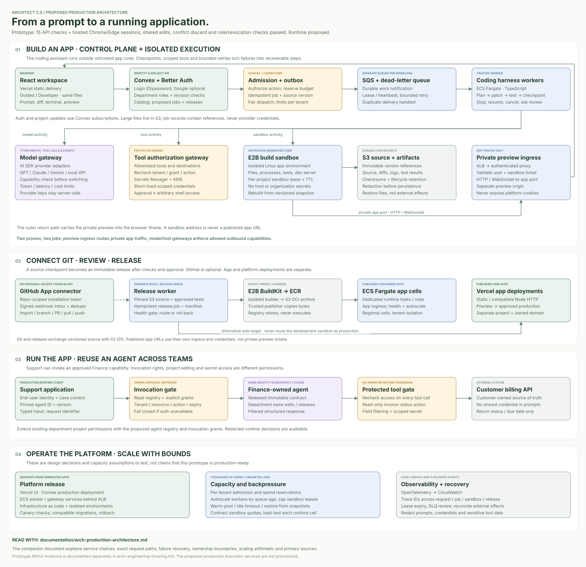
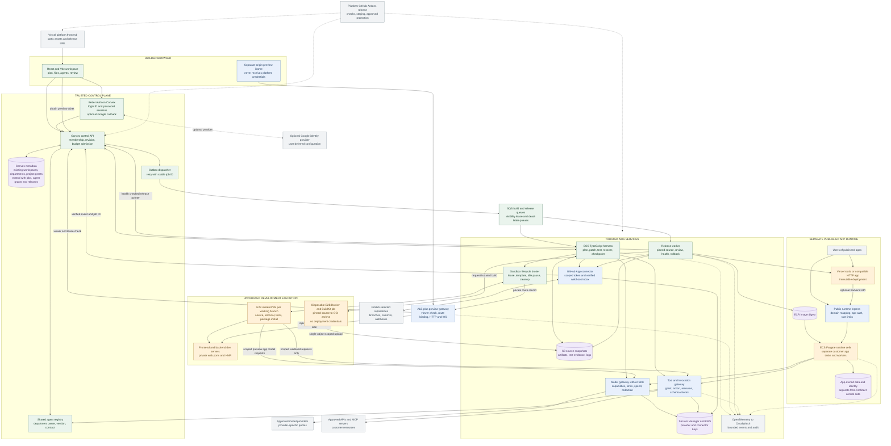
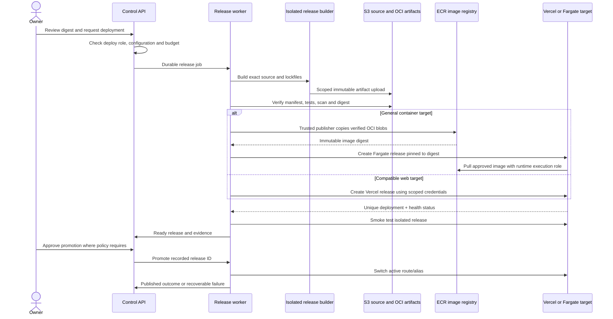

# Architect 2.0: proposed production architecture

This design keeps identity, project permissions and revisions in **Convex**, runs the coding harness in trusted **ECS Fargate workers**, and executes untrusted app code in **E2B sandboxes**. SQS queues separate accepted work from available capacity. Published apps run as separate, reviewed releases, with model, tool and preview gateways enforcing different permissions.

**The production execution system is proposed, not deployed.** The existing React/Vite prototype has real Better Auth login ID/password accounts, department Viewer/Editor grants, shared saved projects and revision-conflict handling. Its public frontend uses a dedicated Convex development backend. Model execution, GitHub/tool connections and generated-app deployment remain labeled simulations. Google is optional and deferred. The [implementation drawing](arch-engineering-drawing.md) and [hosted acceptance record](../verification-records/2026-10-06-hosted-department-acceptance.md) define that verified scope.

Decision baseline: **5 October 2026**. Document and folder-path revision: **7 October 2026**. Vendor references support the proposal; their quotas are dated assumptions to recheck before implementation. The October 7 review spot-checked E2B sandbox/Docker support, Convex limits and SQS delivery semantics. It did not deploy or load-test the proposed services.



[Open the full-size vector drawing](arch-production-architecture.svg) or [PNG rendering](arch-production-architecture.png). The Mermaid definitions below are the editable service and sequence reference.

The architecture covers the [assignment's](https://hiring.lyzrarchitect.space/) requested moving pieces: sandbox selection; planning, coding, tools and error recovery; model switching; frontend/backend/preview communication; proxy responsibilities; GitHub; deployment of generated apps and the platform; and capacity for thousands of builders and runtime users. Each section names the proposed services, why they fit and what would need verification before claiming production readiness.

## The decision in one view

My proposed split is **Convex for the trusted control plane**, **E2B for untrusted development execution**, and **separate release targets for published apps**. A bounded TypeScript agent harness runs in ECS Fargate workers. SQS holds work when demand rises, while Convex keeps durable job checkpoints. The browser gets progress through Convex and preview traffic through an authenticated proxy. Sandbox-controller credentials, GitHub installation tokens and provider keys stay on the server.

**Technical:** The control plane stores identity, permissions, revisions, jobs and release metadata. Sandboxes execute code while it is being edited. Published runtime services execute immutable, reviewed releases. Each lifecycle needs its own credentials, scaling controls and failure boundary.

**ELI10:** You edit and test an app in its own temporary workspace. Once you approve a version, Architect publishes a separate copy for its users. A broken test environment should not give someone access to other projects or published apps.

| Responsibility | Proposed selection | Why this selection; tradeoff |
|---|---|---|
| Platform browser application | Existing React/Vite bundle on Vercel | Preserves the existing client and provides an independently deployable frontend. No server-side rendering migration is necessary for this workspace. Convex documents a Vercel deployment path. [Convex hosting guide](https://docs.convex.dev/production/hosting/vercel) |
| Identity and control data | Existing Convex + Better Auth login ID/password; optional Google deferred; separate production deployment | Extend the development-deployed workspace/department permissions, project grants, revision checks and metadata catalog with durable jobs, immutable source revisions and runtime invocation grants. Live backend smoke passed 15 checks; separate hosted Chrome/Edge checks passed for sessions, shared edits, conflict discard and permission changes. [Hosted acceptance](../verification-records/2026-10-06-hosted-department-acceptance.md). Reactive state suits progress and collaboration; long builds stay outside database transactions. [Convex limits](https://docs.convex.dev/production/state/limits) |
| Durable work admission | Convex job/outbox records, Amazon SQS standard queues and dead-letter queues | Store accepted intent before dispatch; absorb bursts without starting every sandbox immediately. SQS can deliver a message more than once, so lease/checkpoint/idempotency are application responsibilities. [SQS delivery model](https://docs.aws.amazon.com/AWSSimpleQueueService/latest/SQSDeveloperGuide/standard-queues-at-least-once-delivery.html) |
| Agent harness and release workers | TypeScript services on ECS Fargate | Long-lived workers can keep SDK/stream connections, heartbeat and resume jobs; AWS manages their hosts. Trusted worker containers never execute a user's shell command locally. [Fargate execution model](https://docs.aws.amazon.com/AmazonECS/latest/developerguide/AWS_Fargate.html) |
| Editable build and preview execution | E2B managed isolated Linux VMs with versioned Node/Python templates | Supports file and command operations plus a development web server without building a VM fleet. Pause/resume controls idle cost. Vendor availability, runtime limits and contracted concurrency remain dependencies. [E2B lifecycle](https://docs.e2b.dev/sandbox), [persistence](https://docs.e2b.dev/sandbox/persistence) |
| Private preview ingress | Dedicated TypeScript HTTP/WebSocket proxy on ECS, behind an ALB and TLS | Owns viewer authorization and server-side sandbox routing. It can proxy Vite hot reload and streaming endpoints without exposing E2B traffic tokens. ALB supports WebSockets. [ALB listeners](https://docs.aws.amazon.com/elasticloadbalancing/latest/application/load-balancer-listeners.html) |
| Model routing | Internal model gateway with AI SDK provider adapters | One normalized call contract, central credentials, budgets and provider-specific capability validation. AI SDK provides a provider abstraction; semantic equivalence is still something we test. [AI SDK providers](https://ai-sdk.dev/docs/foundations/providers-and-models) |
| Tools, MCP and reused-agent calls | Separate authorization/tool gateway on ECS | Applies tenant, action, resource and consent checks before using connector credentials. A model's tool request is a request, not permission. This service and its policy are our proposed implementation, not a capability supplied automatically by the SDK. |
| Source, imports and artifacts | Private S3 buckets; immutable manifest/digest references in Convex | Keeps large file trees and logs outside the project document. Short-lived object-specific upload/download URLs avoid giving users AWS credentials. [S3 presigned URLs](https://docs.aws.amazon.com/AmazonS3/latest/userguide/using-presigned-url.html) |
| Credentials | AWS Secrets Manager + KMS for gateway/connector secrets; protected Convex environment for its own auth configuration | Restricts who can retrieve each secret and supports rotation. Secrets remain outside project source, prompts and browser state. [Secrets Manager guidance](https://docs.aws.amazon.com/secretsmanager/latest/userguide/best-practices.html) |
| GitHub | GitHub App connector, permission-scoped short-lived installation tokens, signed webhook inbox | Selectable repositories and installation permissions fit project-level access better than a broad permanent user token. [GitHub App comparison](https://docs.github.com/en/apps/oauth-apps/building-oauth-apps/differences-between-github-apps-and-oauth-apps) |
| Published static/compatible HTTP apps | Vercel deployment API, separate project/release identity for each app | A narrow adapter handles supported build output, routing, domains and deploy status. We do not assert all arbitrary code fits this target. [Vercel API](https://vercel.com/docs/rest-api), [deployment model](https://vercel.com/docs/deployments) |
| Published general-purpose services/workers | OCI image in ECR, then separate ECS Fargate runtime cells | Covers Python agents, background workers and server processes that do not fit the first target. Each customer app has its own task boundary and minimal workload identity. Registry scanning supplies one input to release review. [ECR scanning](https://docs.aws.amazon.com/AmazonECR/latest/userguide/image-scanning.html) |
| Container image build | Disposable E2B Docker/BuildKit template per release | Runs the user's Dockerfile away from trusted release credentials. Export an OCI archive; ECR stores the finished image rather than building it. [E2B Docker template](https://docs.e2b.dev/template/examples/docker), [Docker OCI exporter](https://docs.docker.com/build/exporters/oci-docker/) |
| Operational evidence | OpenTelemetry instrumentation with CloudWatch logs/metrics, redacted audit records in object storage | Correlates job, sandbox, model, tool and release events. This is a proposed observability configuration; no existing dashboard, throughput result or security certification is claimed. |

For the first pilot, the harness, dispatcher and release code can share one trusted worker image, with separately scoped processes and roles. The rectangles in the drawing show responsibilities; they do not all need to become separate services immediately. Model and tool gateways still need separate authorization surfaces, even if they share a package. Preview traffic and untrusted customer runtime stay outside the trusted worker network.

## Proposed service diagram

Every box below is a production proposal, including the production instances of services already used in development. Solid arrows describe the proposed data flow. Dashed arrows show deployment, telemetry or an optional handoff. Naming a provider here does not mean its capacity has been purchased.



For large imports, the browser would upload directly to S3 using an authorized upload URL. The control API receives metadata and a verified object digest. An isolated job then unpacks the quarantined import before accepting it as a source revision. A user-supplied S3 path, sandbox ID, container address or repository name still needs validation; the graph does not make it trusted.

## 1. Sandboxes: selection, isolation and lifecycle

I would use E2B for the first real coding runtime. Its documented foundation, as reviewed on October 5, is an isolated Linux VM with command/filesystem operations and lifecycle controls. Controller authentication and restricted public application traffic are separate controls, and we need **both**. Enable secure controller access and create sandboxes with `allowPublicTraffic: false`. Keep the traffic-access token at the gateway so it never appears in an iframe URL. [Controller access](https://docs.e2b.dev/sandbox/secured-access), [application-port access](https://docs.e2b.dev/network/restrict-public-access).

Give each workspace branch a lease bound to `(tenantId, projectId, branchId, revision, sandboxId, generation)`. Only one admitted write job owns the branch at a time. The job persists when a browser disconnects, so the user can reconnect to it. Guessing a sandbox ID must not let another project attach. A review branch gets its own sandbox or immutable snapshot, keeping review work separate from edits on the active branch.

Start with immutable, versioned Node/TypeScript and Python templates, with system tooling pinned. Each project manifest declares its framework, dependency file, install/build/test commands, entrypoint, preview port and resource class. LangGraph, CrewAI, OpenAI Agents and Lyzr adapters make that setup easier; a Custom adapter supplies the same manifest. Support for arbitrary Linux code still needs qualification for libraries, GPUs, privileged containers and individual agent frameworks.

The lifecycle is `queued -> provisioning -> restoring -> ready -> busy -> idle -> paused -> resuming`, with `failed`, `cancelled` and `retired` as terminal outcomes. The proposed defaults are a 15-minute execution lease, a heartbeat every 30 seconds, and a pause after 5 idle minutes. Before reaching the vendor’s continuous-runtime ceiling, force a checkpoint and recreate the environment. Pause an idle preview only after its connections expire, and show the next viewer that it is resuming. S3 source and lockfiles remain the durable recovery copy; an E2B memory snapshot speeds up recovery. A reaper compares expired leases with vendor inventory and stops orphaned environments.

Begin with deny-all outbound traffic, then allow the controlled package mirror and our model/tool endpoints. The E2B documentation describes domain/IP controls and their limits around domains, protocols and shared endpoints. That makes a second check necessary: the tool gateway enforces exact destinations, paths and credential scopes. A hostname allowlist alone is insufficient evidence of exfiltration prevention. Dependency installation also runs inside the untrusted sandbox without organization secrets, because install scripts can execute malicious code. [E2B network policy](https://docs.e2b.dev/network/internet-access).

| Alternative | Reason not selected initially | Reconsider when |
|---|---|---|
| Containers on one shared Docker host | More host lifecycle/security ownership; a stock shared kernel is not the isolation policy we want for arbitrary install scripts | A dedicated security/infra team can maintain hardened tenant isolation and prove it under adversarial workloads |
| Self-managed microVM fleet | Greater control and potentially better economics at stable scale, but image, host, kernel, network, snapshot and scheduler operations become ours | Sandbox usage and data-residency requirements justify those costs |
| Fargate for every edit session | Strong task isolation is useful, but we would build interactive filesystem/terminal/snapshot and developer-preview lifecycle ourselves | Long-running immutable runtime containers; that is the selected published-runtime role |
| Browser-only execution | Attractive for restricted frontend examples, but not an arbitrary Python/backend development environment | Optional fast preview of a validated frontend-only project |

## 2. Agent harness: planning, code, tools and recovery

The harness is an application-controlled state machine. A model can propose a plan or tool arguments; the harness validates them before proceeding. Bounded sequential steps, parallel steps and feedback loops follow the patterns in the AI SDK workflow guide. Recovery must work from our recorded state, without depending on one model’s private conversation state. [AI SDK workflow guide](https://ai-sdk.dev/docs/agents/workflows).

| Stage | Persisted result and execution rule |
|---|---|
| Understand | Prompt, accepted references, project revision, framework manifest and explicit constraints; treat repository text and tool output as untrusted input |
| Plan | Structured tasks, files likely to change, tests, needed tool permissions and estimated budget; user can edit/approve before the build starts |
| Prepare | Reserve quota, acquire branch lease, restore source by digest, install pinned dependencies and report unsupported setup clearly |
| Implement | Read/search/patch through schema-validated tools; command execution only in the sandbox; record changed file hashes before/after |
| Validate | Run actual type/build/tests and bounded preview smoke checks; store exit status and evidence, not just the model's assertion |
| Repair | Classify failure, attempt a bounded patch, rerun affected checks; proposed maximum three repair attempts before user review |
| Present | Human-readable change summary, file diff, test evidence, preview and unresolved limits; no hidden chain-of-thought |
| Checkpoint | Commit source manifest and event cursor; release or hand over branch lease; an external deploy needs its own permission and release operation |

Each accepted operation gets a stable `jobId`, and each logical side effect gets an `operationId` derived from that job, step and action. Keep that idempotency key unchanged across retries; record the attempt number separately. The worker acquires its lease transactionally with a monotonically increasing fencing number. Once a newer lease exists, a stale worker cannot publish a checkpoint or release. Before retrying an external write, reconcile the recorded outcome with the destination. A timed-out request may already have completed a GitHub push or deployment.

Extend SQS visibility while the worker is healthy. If it dies, the next worker reads the last persisted stage, reconciles the sandbox and resumes from there. A duplicate message for a completed or currently leased job does no extra work. A repeatedly failing job stops in the dead-letter queue with a visible explanation. Cancellation revokes the lease and short-lived capabilities, stops streams and commands where supported, checkpoints recoverable source, and pauses or retires the sandbox.

Use a transactional outbox at the queue boundary. One Convex mutation writes the admitted job and its outbox record; a scheduled dispatcher attempts delivery to SQS and records the acknowledgement. A sweeper retries unacknowledged records with the same ID. This gives us a recoverable handoff without claiming an atomic transaction across Convex and AWS. Convex scheduling from mutations is transactional, but scheduled actions are not automatically retried and scheduled functions do not inherit user authentication. The dispatcher therefore uses server-validated stored authority plus a fresh permission check, rather than accepting an arbitrary `userId` argument. [Convex scheduling semantics](https://docs.convex.dev/scheduling/scheduled-functions).

| Failure | User-visible outcome | Recovery policy |
|---|---|---|
| Provider 429 or transient outage | Waiting for provider capacity; cancel remains available | Honor retry delay, jitter, bounded retries; use only a permitted capability-compatible fallback |
| Invalid tool arguments | Step rejected with a concise validation reason | One corrected request within the step budget; never execute malformed input |
| Dependency/build failure | Actual command/exit evidence and proposed fix | Bounded repair loop; keep last good revision and preview |
| Sandbox lost | Restoring the most recent checkpoint | Recreate from source/template; disclose loss of uncheckpointed process state |
| Permission revoked | Action stopped / access removed | Recheck before next protected call; no fallback credential |
| Conflicting project revision | Newer changes need review | Reject overwrite, show diff; reconcile or create a branch |
| Budget exhausted | Paused with completed work intact | No hidden unbounded retries; new budget requires an explicit product action |

I would keep the long-running loop outside Convex actions. The documented Node-action duration is finite, and long executions consume action concurrency. Convex can hold job metadata without also carrying thousands of waiting processes alongside UI data traffic. Temporal Cloud is a credible alternative when workflows need multi-hour timers or complex compensations. For this first bounded pipeline, the existing database plus queue and leases avoids adding another orchestration service, **but leaves recovery implementation and testing with us**. If the workflow grows more complex, orchestration can move to Temporal while retaining the idempotent sandbox and tool adapters. [Temporal workflow model](https://docs.temporal.io/workflows).

## 3. Model-agnostic generation and runtime

Store this model policy with the task: `{purpose, modelAlias, permittedProviders, requiredCapabilities, maxInputTokens, maxOutputTokens, spendLimit, timeout}`. At the gateway, aliases such as `planner`, `coder`, `repair` and `app-runtime` resolve to configured provider/model versions. AI SDK supplies normalized provider access and registries/custom aliases. Our gateway adds tenant budgets, routing and audit records. [Custom provider mapping](https://ai-sdk.dev/docs/reference/ai-sdk-core/custom-provider).

Switch models at a checkpoint. Reconstruct the portable transcript from user messages, public step summaries, files and tool results. Check structured-output, tool-calling, streaming, context and image requirements before allowing the switch. If a model lacks a required capability, mark it unavailable for that step. Record the provider and model version used for every attempt so a fallback never silently removes functionality.

Keep three choices separate: the builder’s coding model, the generated agent’s runtime model, and its framework. A user who switches coding providers should still have the same LangGraph app afterward. Runtime code uses a scoped gateway client, or an explicitly supplied compatible customer adapter. A fallback cannot expand permissions or send sensitive content to a provider the tenant disallowed. Before changing the default model, compare output validity, repair rate, latency and cost on a fixed project evaluation set; a compatible SDK interface does not establish equivalent output quality.

## 4. Frontend, backend, sandbox and live preview

The frontend sends edits and prompts through the control API, then subscribes to compact job events and project metadata through Convex. Sandbox control stays with the worker. A file save carries `expectedRevision`; in the proposed production design, an accepted save creates the next immutable source manifest and a concurrent save gets a conflict response with both revisions. The prototype already rejects stale revisions, chains acknowledged revisions in its client queue, protects dirty drafts, and uses an authorized metadata catalog with an active full-project subscription. Those backend changes are deployed in development. Independent live clients verified editor propagation and stale-write rejection. Hosted Chrome/Edge checks went further: editor changes reached the owner without a reload; conflicting owner source stayed visible with Save blocked; explicit discard restored the remote source; viewer controls, revocation and shared-app restoration updated live. The same QA app’s 3,270-byte conflict-draft HTML download was later verified by exact file hash. Durable job events, immutable object-store manifests and sandbox control are still proposed extensions. [Supplemental verification](../verification-records/2026-10-06-supplemental-ui-verification.md), [Hosted acceptance](../verification-records/2026-10-06-hosted-department-acceptance.md), [Project functions](../application/backend/projects.ts), [catalog](../application/backend/catalog.ts), [save queue](../application/shared-logic/project-save-queue.ts), [card reconciliation](../application/shared-logic/project-sync.ts).

Bind each preview ticket to the viewer, tenant, project, lease generation and allowed app port. The browser opens a project-specific origin under a **different registrable domain** from the platform. The gateway exchanges a short-lived, single-use bootstrap ticket for an HttpOnly viewer session, then removes the bootstrap URL before forwarding traffic to user code. If third-party cookie restrictions prevent embedding, provide an explicit top-level preview window/bootstrap flow while retaining authorization.

On every new HTTP request or WebSocket upgrade, the gateway validates the viewer and live route. It forwards traffic only to the broker’s registered E2B host/port and adds E2B’s traffic token server-side. Strip platform and bootstrap credentials; constrain redirects, headers, body size and connection counts; preserve only application-scoped traffic. A URL supplied by the sandbox must not turn the gateway into an open network proxy. Revocation closes tracked WebSocket sessions, and long-lived connections periodically revalidate their lease.

The preview iframe can run scripts at its own origin, without access to the platform cookie or parent DOM. Apply a project-specific CSP and a narrow `postMessage` schema that checks the sending origin and window. Enable only documented preview capabilities, leaving popups and top navigation off by default. Frontend hot reload travels through the gateway’s WebSocket route. The app’s backend development server can share that preview origin, so it does not need a separately exposed privileged API. E2B documents restricted public-port access and web endpoints; the viewer authentication and proxy policy described here would be our own layer. [E2B web URLs](https://docs.e2b.dev/network/public-url).

```mermaid
sequenceDiagram
  actor Builder
  participant UI as React workspace
  participant C as Convex control API
  participant Q as SQS
  participant W as Harness worker
  participant S as E2B sandbox
  participant M as Model/tool gateways
  participant P as Preview gateway
  Builder->>UI: Submit prompt or approve saved plan
  UI->>C: Expected revision + idempotency key
  C->>C: Check membership, budget; persist job/outbox
  C-->>UI: Job accepted + event subscription
  C->>Q: Dispatcher sends stable job ID
  Q->>W: Leaseable work
  W->>C: Acquire fenced job/branch lease
  W->>S: Restore authorized source; start dev servers
  loop Bounded implementation and validation
    W->>M: Model/tool request with scoped authority
    M-->>W: Validated result / rejection
    W->>S: Apply patch, run command/test
    S-->>W: Output and exit evidence
    W->>C: Checkpoint + bounded progress events
    C-->>UI: Reactive update
  end
  UI->>C: Request preview ticket
  C-->>UI: Short-lived viewer ticket
  UI->>P: Bootstrap isolated preview
  P->>C: Validate viewer and active lease
  P->>S: Authorized app HTTP / WebSocket
  S-->>P: Rendered app and HMR stream
  P-->>UI: Isolated preview
```

## 5. Where the proxies sit

| Boundary | Traffic direction | Responsibility | Must not do |
|---|---|---|---|
| Preview ingress | Browser -> preview gateway -> E2B web port | Viewer/session/lease authorization, route binding, HTTP/WebSocket forwarding, preview limits | Expose controller port, forward platform cookies, or trust a supplied destination URL |
| Model egress | Harness/generated runtime -> model gateway -> provider | Authenticate workload, choose allowed model, validate capabilities, reserve budget, rate-limit and redact | Treat model output as permission, or give the sandbox a global provider key |
| Tool/API egress | Harness/runtime -> tool gateway -> selected API/MCP/reused agent | Validate schema, current grant, action/resource scope, external-write approval and credentials | Allow an arbitrary URL or all account scopes because the prompt asks for them |
| Published runtime ingress | App visitor -> app domain/router -> released service | App-level identity, tenant/release routing, rate limits, safe streaming | Accept an Architect project ID as proof that the visitor may access app data |

These gateways check different permissions even when some code initially shares a deployment. Ingress decides who can view the running code. Egress decides which outside actions that code can take. We need both checks: a private preview can still call a customer API, and a restricted tool can still sit behind an exposed development server.

## 6. GitHub import, branch sync and recovery

Connect a GitHub App installation to the authenticated Architect tenant and selected repository IDs. The initial import needs read access. Creating commits, branches or pull requests requires the additional permissions and the user’s intent to write. The connector mints a repository-limited installation token when needed, while its private key stays in Secrets Manager. GitHub’s documented controls cover token expiry and narrowing permissions/repositories. [Installation-token documentation](https://docs.github.com/en/apps/creating-github-apps/authenticating-with-a-github-app/generating-an-installation-access-token-for-a-github-app).

Resolve an import to an exact commit SHA, download it to quarantine storage and retain its provenance. Record the base SHA when branch work starts. Pull shows remote metadata and a diff; push compares the expected remote head and returns a conflict if it changed. Use a dedicated Architect branch or a reviewed target branch. An installation token may permit writes to more than one branch, so our connector still needs branch allowlists, checked API operations and repository protection. Keep reusable write tokens out of untrusted shell processes by using server-side GitHub API operations.

Verify a webhook’s raw-body HMAC signature before parsing it. Then deduplicate the delivery ID, check the installation/repository mapping and enqueue the work. Installation removal or revocation disables future sync. User and project fields inside the webhook payload cannot establish authority. [GitHub webhook validation](https://docs.github.com/en/webhooks/using-webhooks/validating-webhook-deliveries).

Building should continue without GitHub. S3 manifests retain the source when GitHub is disconnected or unavailable, and the UI distinguishes a saved checkpoint from a completed remote push. If a push response is ambiguous, reconcile the target commit and branch before attempting another write.

## 7. Deploying user applications

Treat deployment as a new job, pinned to the reviewed source digest, framework manifest, test evidence, runtime configuration version and target environment. Rebuild the release in a clean isolated builder. Dependency hooks and Dockerfiles remain untrusted, so that environment gets temporary upload access to one build artifact. Signing and promotion credentials stay with the release worker. The development sandbox is never reused as the production server.

For container builds, use a **fresh E2B sandbox with a versioned Docker/BuildKit template**. E2B documents Docker support inside its VM; our template would pin Docker, Buildx and base-image versions. Buildx uses the `docker-container` driver and OCI exporter, because the ordinary Docker driver does not support that exporter. The build runs the reviewed source/Dockerfile, produces an OCI archive and manifest, and uploads them through a short-lived URL scoped to one new S3 object. A separate trusted publisher checks object size, manifest paths, digests and policy before copying image blobs/manifests to ECR through its registry API. That publisher never executes the image or Dockerfile. ECR credentials and release-signing keys stay outside the source build VM. This combined build/publish path still needs an integration test. [E2B Docker support](https://docs.e2b.dev/template/examples/docker), [OCI export behavior](https://docs.docker.com/build/exporters/oci-docker/).

The release worker checks the artifact manifest, then applies the adapter for the selected target:

1. **Static or supported request/response web app:** create a distinct Vercel deployment from the pinned source/output, configure only app-scoped environment references, wait for build/readiness, and smoke-test its unique deployment URL. Node HTTP support is target-specific; long processes are routed to the container option.
2. **General container/web service or long-running agent:** build an OCI image in an isolated build job, upload to a scoped ECR repository, record its immutable digest and scan result, then start an ECS task/service in a separate customer-runtime account/network cell. Use a non-root process, bounded CPU/memory, read-only filesystem where compatible, no privileged mode and no platform administration role.
3. **Promotion:** owner reviews the ready release; update the active release pointer/domain only after readiness. Preserve the previous digest/deployment for rollback. A domain check requires actual DNS ownership verification in the real product; the prototype's domain checker is only a simulation.

For active Fargate web services, declare a minimum replica count. Queue background jobs separately and pause inactive worker-only apps. Request-driven scale-to-zero with instant HTTP wake-up needs either a compatible serverless target or a separately implemented and measured cold-start router. Database migration also needs its own review: rolling back an app’s code does not reverse arbitrary changes to its data.

Each published app owns its identity and data setup. It can use a separate Convex deployment, another database or a customer service through an adapter, without access to Architect’s `projects` table. Its configured identity system authenticates end users. Before invoking a shared agent or tool, the runtime gateway binds the authenticated app/user to a release and its permitted resources.



## 8. Deploying the Architect platform itself

Keep the platform repository separate from generated application repositories. The proposed GitHub Actions pipeline checks the platform, builds its Vite frontend, deploys staging Convex functions/schema, and builds signed, pinned trusted-worker images. Infrastructure definitions create queues, buckets, roles, ALBs and ECS services in staging before production. CI uses short-lived workload federation where available; project files never supply deployment credentials.

After staging checks pass, a reviewed promotion deploys the Vercel frontend and matching Convex API, then rolls trusted services using compatible event and API versions. Expand the schema first, deploy consumers, migrate deliberately, and remove old fields afterward. Each build job records its harness/template version so an in-flight worker can finish or resume during the rollout. Login ID/password remains the chosen sign-in flow, with separate Better Auth configuration, trusted origins and session secrets per environment. If Google is enabled later, give development, staging and production their own OAuth callbacks and origins. Google is deferred and is not required to verify password sign-in.

The approved assignment prototype was published on 2026-10-06 at the canonical Architect URL, with its public source repository and the existing development backend. The interface keeps its simulation labels. The proposed AWS/E2B runtime was not needed to host that prototype and has not been deployed. Hosted Chrome/Edge checks passed for account sessions, shared editing, conflict discard and live permission changes; the acceptance record names the remaining UI limits. No hiring-form submission has been performed. [architect-2-weld.vercel.app](https://architect-2-weld.vercel.app), [public source repository](https://github.com/rishimunikesarwani-hub/architect-2), [hosted acceptance](../verification-records/2026-10-06-hosted-department-acceptance.md).

## 9. Thousands of builders and runtime users

The figures below are **planning assumptions**, not measured throughput, SLAs or purchased quotas. To size the system, count active work, connections, model throughput and external limits. A logged-in builder may be reading a project without running a compile, so we need to model those loads separately.

### A concrete initial scale target

| Assumption | Arithmetic | Capacity consequence |
|---|---|---|
| 5,000 connected builders; 12% actively building | `5,000 * 0.12 = 600` build jobs | Admit 600 active jobs; remaining requests queue fairly |
| Average active build duration 120 seconds | `600 / 120 = 5` new builds/second at steady state | Creation, model and dependency capacity must sustain the arrival rate |
| 400 additional active preview-only sessions; 100 warm sandboxes | `600 + 400 + 100 = 1,100` live sandboxes | Plan 25% headroom: `1,100 * 1.25 = 1,375`; contract about 1,500 capacity |
| Each live sandbox requests 2 vCPU and 2 GiB | `1,100 * 2 = 2,200` vCPU and GiB | This is sandbox-provider capacity/cost, separate from AWS coordinator capacity |
| Each build uses 12 model calls, averaging 2,000 input + 500 output tokens | `5 * 12 = 60` calls/sec; `60 * 2,500 * 60 = 9,000,000` tokens/min | Build budget needs roughly 3,600 requests/min and 9M tokens/min across allowed providers |
| 200 simultaneously active published apps at 2 HTTP requests/sec | `200 * 2 = 400` requests/sec | Size public runtime ingress independently from builder ingress |
| 5% of app requests start an agent job; mean run 20 seconds | `400 * 0.05 = 20` jobs/sec; `20 * 20 = 400` in-flight runtime jobs | Separate runtime queue/pool; builder demand cannot starve app users |
| Each runtime job uses 2 calls averaging 1,500 input + 300 output tokens | `20 * 2 = 40` calls/sec; `40 * 1,800 * 60 = 4,320,000` tokens/min | Combined example: 6,000 model requests/min and 13.32M tokens/min |
| Add 25% model headroom | `6,000 * 1.25 = 7,500` RPM; `13.32M * 1.25 = 16.65M` TPM | Must negotiate/check quotas per actual provider/model; one aggregate quota is not interchangeable with all model quotas |

At the same arrival rate of 5 builds/sec, a mean build time of 240 seconds would double the required active build slots to 1,200. If all 5,000 builders start together, the 600-slot admission policy creates a queue, and the UI must show that wait. Lower latency, fewer model calls and dependency caching may reduce demand, but we need measurements before counting on those gains.

### Known limits and the action they imply

The E2B table consulted on 2026-10-05 listed Pro concurrency of **100–1,100**, sandbox creation at **5/sec**, and a **24-hour** continuous runtime; Enterprise capacity was custom. A 1,500-slot target therefore needs an explicit capacity agreement, plus prewarming for creation/resume bursts. Its concurrent-template-build limit is separate from the number of commands that can execute inside user sandboxes. Recheck the actual project’s quota before running a load test. [E2B billing and limits](https://docs.e2b.dev/billing).

The Convex limits consulted on 2026-10-05 listed S16 at **1,000 concurrent sessions** and S256 at **10,000**. The default S16 deployment therefore cannot substantiate a 5,000-builder target. S256 is a candidate, subject to load tests, bandwidth/write limits and pricing. Keep subscriptions bounded to relevant project/event windows rather than every file or every job in the tenant. [Convex deployment limits](https://docs.convex.dev/production/state/limits).

With 1,000 active build/runtime jobs sending one progress batch every two seconds, the control plane would receive about 500 event writes/sec. At 2 KiB/batch, that is about 1 MiB/sec before indexes, retries and other writes. These are calculations, not throughput measurements. Put token streams and large logs in bounded streams or object storage, and combine progress updates for the UI. Debounce editor saves and upload changed file blobs so a save does not serialize a whole large repository into one Convex document.

For coordinator sizing, assume a worker can supervise 20 I/O-heavy jobs, then measure that assumption. Supporting 1,000 jobs would require 50 workers. At a proposed 0.5 vCPU/1 GiB each, that means 25 vCPU/50 GiB before gateways and redundancy. Benchmark the ratio under stream parsing and checkpoint load. Scale workers using admitted backlog, oldest-message age and utilization, while keeping a hard ceiling tied to sandbox/model capacity. ECS service scaling still operates within those downstream quotas. [ECS service scaling](https://docs.aws.amazon.com/AmazonECS/latest/developerguide/service-auto-scaling.html).

For a conditional container-runtime example, 200 active apps with two replicas at 0.25 vCPU/0.5 GiB would use 100 vCPU/200 GiB **in addition** to coordinator capacity. The cost of thousands of always-on apps grows linearly unless their workloads fit another target. Request Fargate vCPU, launch, networking/IP and service quotas with enough rollout headroom. Fargate launch throttling has its own limits; more vCPU allowance does not by itself allow an unlimited launch rate. [Fargate throttling](https://docs.aws.amazon.com/AmazonECS/latest/developerguide/throttling.html).

Bound each runtime cell’s failure impact. One starting assumption is a maximum of 50 container apps per regional ALB/cell, with two replicas per active app. This leaves room below the October 5 documentation’s default 100 rules/ALB and 100 target groups/ALB. Adjust the app count and routing design after measurement, rather than placing thousands of routing rules on one ALB. Domain-certificate and provider project/deployment limits also need verification. [ALB quotas](https://docs.aws.amazon.com/elasticloadbalancing/latest/application/load-balancer-limits.html), [Vercel limits](https://vercel.com/docs/limits).

### Backpressure and failure containment

Admission reserves per-tenant concurrent jobs and estimated spend atomically. The proposed pilot policy allows one writer per project branch, two active builds per paid workspace, a global ceiling of 600 builds, a separate runtime reservation and a bounded queue. These are adjustable product policies. An accepted request receives `queued`, a wait estimate/range and a cancel control. Once the queue is full, return a clear rejection with a retry hint instead of accepting work we cannot retain.

Keep separate semaphores for sandbox creation/live capacity, model RPM/TPM, tool connectors, GitHub operations and deployment targets. Each service backs off independently on a 429. Fair scheduling prevents one tenant from occupying the full worker pool. Reserve capacity for cancellation, access revocation, health checks and released-app runtime. If a provider fails, its circuit breaker pauses affected jobs. An alternative provider is available only when the tenant’s policy allows it.

Start the pilot in one region. Multi-AZ trusted services and vendor-managed recovery can reduce component failures, but this proposal does not establish globally active-active Convex state or zero recovery time. Regional runtime cells and copied immutable artifacts limit the affected area. During a control-plane outage, privileged operations fail closed; independently hosted, already published static pages may continue serving. Set recovery targets after measuring backup restoration and outage drills.

## 10. Ownership, shared agent reuse and multiplayer

The inherited product direction is departmental ownership with permissioned reuse in a shared Architect–Studio workspace, using Support and Finance as the example. It comes from `Research_Data/multiplayer-agent-deck/deck-brief.md`, a historical local source outside this repository. The earlier `architecture.md`, also outside this repository, proposed server drafts and conflict handling and deferred character-level co-editing. Those documents establish prior direction, not deployment evidence. The department project-access and expected-revision code is now deployed in development. Its 15-check live API smoke covers role enforcement, revocation and stale-write denial; hosted Chrome/Edge checks cover session reload, shared edits, conflict preservation/discard, viewer controls, revocation/restoration and logout/re-entry. The shared agent registry and runtime permissions remain a separate proposal. [Hosted acceptance](../verification-records/2026-10-06-hosted-department-acceptance.md).

Extend the existing development-deployed `workspaces`, `departments`, `workspaceMembers`, `projectGrants`, `projects` and `projectCatalog` schema. Add `projectRevisions`, `agentVersions`, `invocationGrants`, `jobs`, `events` and `releases` for immutable execution history and runtime capabilities. Current department grants authorize project reads and edits; the project owner or workspace administrator manages access. Agent invocation needs another check. Each immutable agent version declares its input/output schemas, allowed tools and department owner. Project membership, agent editing, release and invocation each retain their own permission check. Architect and Studio could share one registry once a supported identity/API integration is validated. The current in-app Studio handoff remains a simulation. [Existing schema](../application/backend/schema.ts), [server authorization](../application/backend/access.ts), [department operations](../application/backend/teams.ts).

For example, Support requests Finance’s `invoice.status.read` capability for an approved customer/case scope. Finance approves a pinned version, permitted fields and an expiry. At runtime, the invocation gateway checks trusted caller identity, tenant, current grant, version and input schema. The Finance agent’s tool call gets another check at the billing API boundary, and only approved fields return. Editing a prompt, selecting the fictional Finance persona or joining the project cannot grant that capability. Revocation blocks subsequent protected calls and cancels relevant long-lived sessions/jobs where possible. It cannot undo an external action that has already completed.

Keep the implemented expected-revision compare-and-save flow for editing, and add comments and a conflict diff before taking on character-level co-editing. Reuse should point to a versioned agent contract while keeping the owning team’s credentials and private memory private. An upgrade shows contract changes and asks for compatibility review where needed. Today’s AgentLibrary copies a described contract into a new owner’s project. Its browser personas and approvals are fictional, separate from the real project-permission code. That flow demonstrates the intended UX; runtime invocation still needs to be built.

## 11. What is implemented and what would prove the proposal

| State | Evidence boundary |
|---|---|
| Implemented prototype source | React workspace; local demo persistence; Better Auth login ID/password; owner/workspace-admin and department editor/viewer project permissions; expected-revision saves and dirty-draft queue; metadata catalog with authorized full-project watch; source/ZIP parser; isolated HTML preview; labeled feature simulations; engineering artifacts |
| Published prototype and source | Approved publication completed on 2026-10-06. Canonical frontend origin: [https://architect-2-weld.vercel.app](https://architect-2-weld.vercel.app). Public repository: [rishimunikesarwani-hub/architect-2](https://github.com/rishimunikesarwani-hub/architect-2). The hosted frontend uses the same development backend; publication does not deploy the proposed execution infrastructure. |
| Development backend deployed and verified | Approved deployment to `dev:perceptive-ermine-27` on October 5 at 22:44 IST. Backfill returned `done: true, migrated: 0`; readiness password true, Google false. Normal Better Auth HTTP plus independent Convex clients passed 15/15 live checks: four account sign-ins, same shared app/source, editor propagation, viewer/outsider/anonymous denial, stale conflict, revocation, wrong-password rejection and logout invalidation. [Smoke report](../verification-records/2026-10-05-department-backend-smoke.json) |
| Hosted browser acceptance passed within scope | Independent Chrome owner and Edge member sessions reloaded; an editor save propagated without owner reload; conflicting owner source stayed intact with Save blocked, then explicit discard restored remote source. A live Finance Viewer change disabled editing/access management/GitHub/deploy controls; revocation closed and removed the app; Support Editor restoration and Edge logout/reload/normal sign-in returned the shared app. [Acceptance record](../verification-records/2026-10-06-hosted-department-acceptance.md) |
| Additional download evidence | The same synthetic QA app's 5,415-byte JSON source export and 3,270-byte conflict-draft HTML file arrived and were verified by file hashes and content checks. Export source produces JSON; no ZIP export is claimed. [Supplemental verification](../verification-records/2026-10-06-supplemental-ui-verification.md) |
| Hosted ZIP import acceptance | After Chrome file-access permission was enabled, the actual chooser imported `sample-projects/import-demo.zip` into a new private Personal workspace Custom app. Exact `index.html` and `README.md`, preview-button interaction, a saved heading edit and persistence after reload/reopen passed with no sampled application errors. This is a bounded two-file fixture check. [Import acceptance](../verification-records/2026-10-06-hosted-import-acceptance.md) |
| Remaining browser evidence limits | Signup was user-performed, not observed. These checks do not establish arbitrary archive/framework execution, every retry/private-copy branch or download format. Google remains user-deferred and optional. |
| Simulated UX | Prompt generation, external integrations, shared-agent grants, GitHub, Studio, model execution and generated-app deployment |
| Proposed here | E2B, AWS infrastructure, model/tool/preview gateways, durable harness, real shared registry and app runtime, production deployment pipelines and scaling policies |
| Proposed runtime remains unproven until measured | Sandbox isolation tests, worker/runtime reconnect and recovery, runtime token/invocation-grant revocation, GitHub duplicate delivery handling, generated-app release rollback, representative framework runs, and the capacity/latency targets above. Passed prototype project-role checks do not prove those runtime controls. |

The first execution milestone should demonstrate one complete path: prompt -> approved plan -> isolated file patch -> actual test -> protected live preview -> immutable checkpoint. Next, demonstrate recovery from worker death without duplicate external effects, a two-user denied edit/invocation, and one clean deployment with rollback. Load-test the stated workload mix and secure quotas before increasing admission. These are production validation milestones, beyond the dummy flows permitted for the assignment’s UI acceptance.

Use the requirement audit to see the source and UI evidence for each feature. This document explains the proposed engineering work; it does not replace a live prototype or a tested runtime. The published prototype should be described by its verified capabilities, rather than as an implementation of the whole drawing. [requirement audit](../verification-records/2026-10-05-requirement-audit.md).
